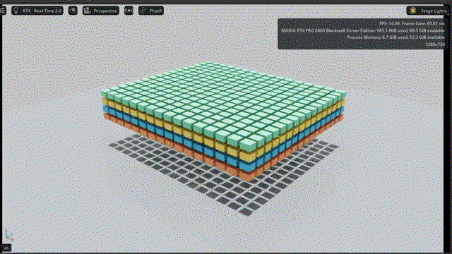
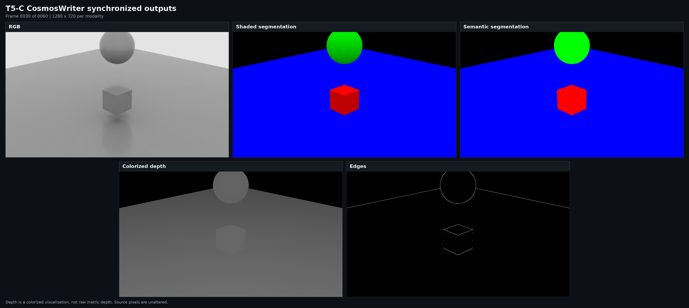

# Isaac Sim and Isaac Lab GPU Validation

Reproducible container tests for Isaac Sim 6.0.1 and Isaac Lab on an NVIDIA
RTX PRO 6000 Blackwell Server Edition GPU.

This repository turns a set of researched platform-risk questions into
measurable tests. No prior hardware failure or customer reproduction was
available. The results therefore describe proactive qualification on one
documented VM, not product certification or proof that a failure cannot occur.

## Visual Replays

The measured tests run headlessly. Separate WebRTC replays make selected
workloads visible in a browser for recording and human observation.

### T2: GPU PhysX Replay



### T4: Tiled-Camera Replay


### CosmosWriter Modalities



The panels show the same validated frame. Depth is colorized for visualization
and is not raw metric depth.

### T6: Newton Ant Replay


See [media/README.md](media/README.md) for provenance and sanitization guidance.

## Questions Covered

1. Does Isaac Sim 6.0.1 launch cleanly in a headless container and stream to a
   browser?
2. Does a GPU PhysX workload remain on `cuda:0` without CUDA error 719 or an
   observed CPU fallback?
3. Can an Isaac Lab articulation/contact task complete repeated PhysX soaks?
4. Does the tiled-camera path deliver complete, distinct RGB buffers without
   hanging at increasing camera counts and resolutions?
5. Does CosmosWriter produce complete video, RGB, depth, semantic,
   segmentation, and edge outputs?
6. How do the shipped PhysX and Newton MJWarp presets compare on the same task,
   seeds, scale, and training envelope?

The original issues and the limits of what one VM can establish are preserved
in [docs/questions.md](docs/questions.md).

## Tested Stack

| Component | Tested value |
|---|---|
| GPU | NVIDIA RTX PRO 6000 Blackwell Server Edition, full PCIe pass-through |
| Guest | Ubuntu 22.04.5 LTS, kernel 5.15.0-181-generic |
| Driver | 595.84 |
| Docker / NVIDIA Container Toolkit | 29.6.0 / 1.19.1 |
| Isaac Sim | `nvcr.io/nvidia/isaac-sim:6.0.1` |
| Isaac Sim digest | `sha256:783444c706538aa76cf5126e911ddc5e618779e6105305ad4af4260362a30aa9` |
| Isaac Lab | `nvcr.io/nvidia/isaac-lab:3.0.0-beta2-post1` |
| Isaac Lab digest | `sha256:18b95be31ec02017fec4c7f1cf51aac9bb7ea9fd868d0f051f5d71837b54bc5f` |
| Isaac Lab bundled Isaac Sim | `6.0.1-rc.7+release.42383.32955d8d.gl` |
| Python / Torch / Warp / RSL-RL | 3.12.13 / 2.10.0+cu128 / 1.13.0 / 5.0.1 |

The Isaac Lab image is a beta track selected because this exact image bundled
the tested Isaac Sim build and shipped both `physx` and `newton_mjwarp`
presets. All scripts allow the image reference to be overridden.

## Result Snapshot

| Test | Result on the tested VM |
|---|---|
| T0 inventory | GPU, VM, driver, container runtime, rendering, and NVENC were identified |
| T1 clean launch | Isaac Sim 6.0.1 reached streaming-ready state and accepted a browser WebRTC session |
| T2 GPU PhysX smoke | 1,024 rigid bodies completed 600 steps on `cuda:0`; lifecycle and driver warnings remain documented |
| T3 PhysX soak | Three 16,384-environment Ant runs completed 393,216,000 transitions |
| T4 tiled cameras | Standalone headless control failed to produce RGB; Full Streaming delivered 600/600 buffers from 16 cameras at 320 x 240 |
| T5 CosmosWriter | Standalone runs delivered 56/60 frames; Full Streaming delivered 60/60 for five modalities and five H.264 videos |
| T6 Newton comparison | Six A/B runs completed 78,643,200 transitions; Newton training throughput was 2.62x PhysX, with longer cold startup |
| T6 visual replay | A 16-environment Newton policy replay was visible and moving in the browser |

These split results matter. A pass in Full Streaming does not erase the
standalone T4/T5 failures. See [results/tested-configuration.md](results/tested-configuration.md)
for measurements, warnings, and limitations.

## Quick Start

Prerequisites:

- Linux host with a supported NVIDIA GPU and driver.
- Docker Engine with NVIDIA CDI devices available as `nvidia.com/gpu=all`.
- Access to `nvcr.io` and acceptance of the image licenses.
- `bash`, `curl`, `jq`, `rg`, and `nvidia-smi` on the host.
- TCP and UDP ports reachable only from a trusted network for browser replay.

Configure the headless WebRTC deployment:

```bash
cp deploy/.env.example deploy/.env
${EDITOR:-vi} deploy/.env
./deploy/start.sh
```

Open `http://<ISAACSIM_HOST>:<WEB_VIEWER_PORT>` from a machine that can reach
the host. The viewer has no built-in authentication or TLS termination. Do not
expose it directly to the public Internet.

Run the tests in order:

```bash
./scripts/collect_inventory.sh
./scripts/run_compatibility.sh
./scripts/run_gpu_physx_smoke.sh
./scripts/run_isaac_lab_preflight.sh
./scripts/run_physx_soak.sh
./scripts/run_tiled_camera_progression.sh
./scripts/run_cosmos_writer_headless.sh
./scripts/run_cosmos_writer_streaming.sh
./scripts/run_backend_comparison.sh
```

The default soak and comparison scales are intentionally substantial. Start
with the lower-cost gates in [docs/reproduction.md](docs/reproduction.md), then
increase scale only after they pass.

## Repository Map

```text
deploy/     Headless Isaac Sim and WebRTC viewer deployment
docs/       Questions, test plan, reproduction, and privacy guidance
media/      Placeholders for browser screenshots and GIFs
results/    Curated, sanitized results from the reference run
scripts/    Host-side test orchestration and evidence collection
tests/      Isaac Sim Python workloads and output validator
```

Generated output goes under `output/` and is ignored by Git. Review
[docs/privacy.md](docs/privacy.md) before sharing any generated evidence.

## Interpretation

- Results apply to the documented images, task definitions, parameters, and
  GPU configuration only.
- A passing soak narrows risk; it does not prove a CUDA failure is impossible.
- PhysX and Newton use different shipped solver configurations. Throughput
  comparisons are not numerical-equivalence claims.
- WebRTC rendering and NVENC add load and are kept outside measured headless
  comparisons.
- RTX PRO 6000 results do not certify another GPU model.

## Upstream Documentation

- [Isaac Sim container installation](https://docs.isaacsim.omniverse.nvidia.com/latest/installation/install_container.html#isaac-sim-app-install-container)
- [Isaac Lab documentation](https://isaac-sim.github.io/IsaacLab/)

Isaac Sim, Isaac Lab, CUDA, PhysX, RTX, and NVIDIA are trademarks or products
of NVIDIA Corporation. This repository is an independent test record and is
not an official certification.
